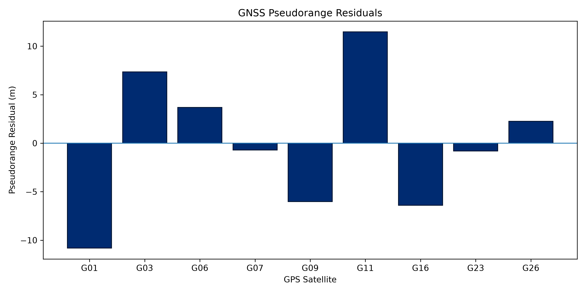
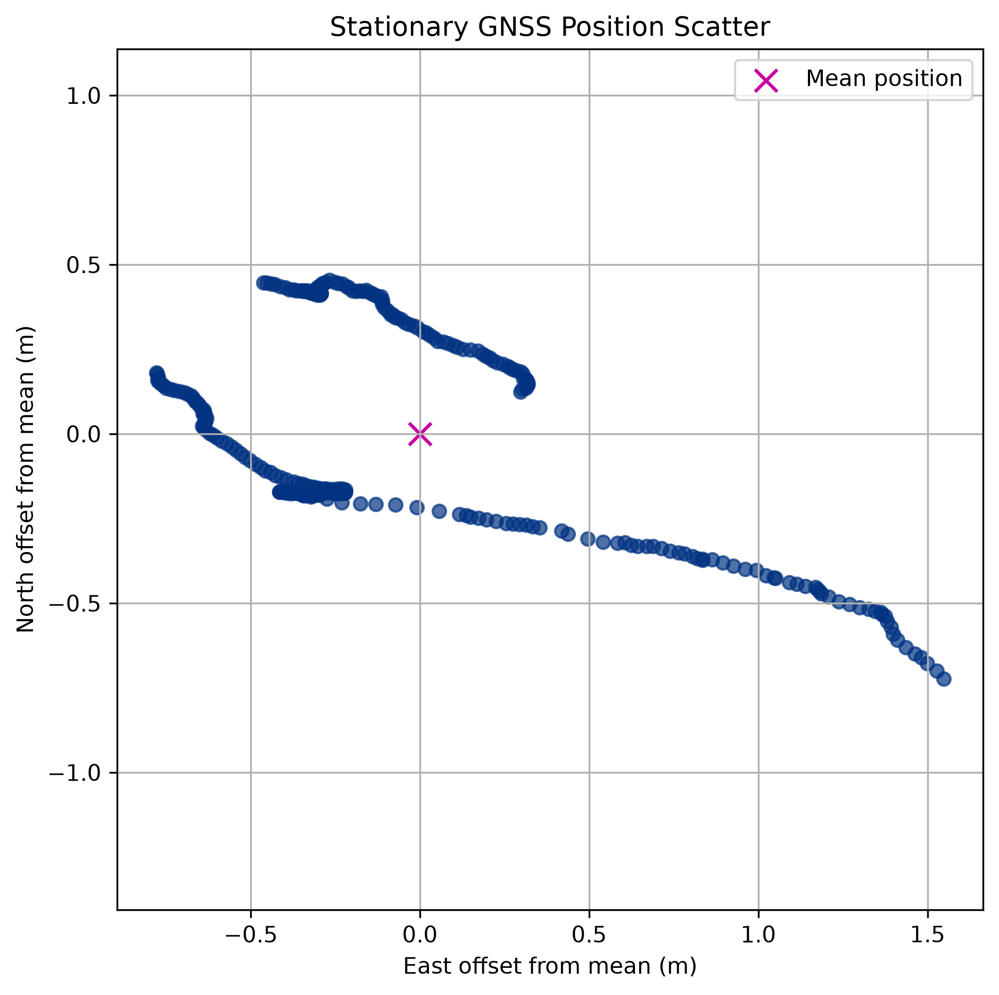
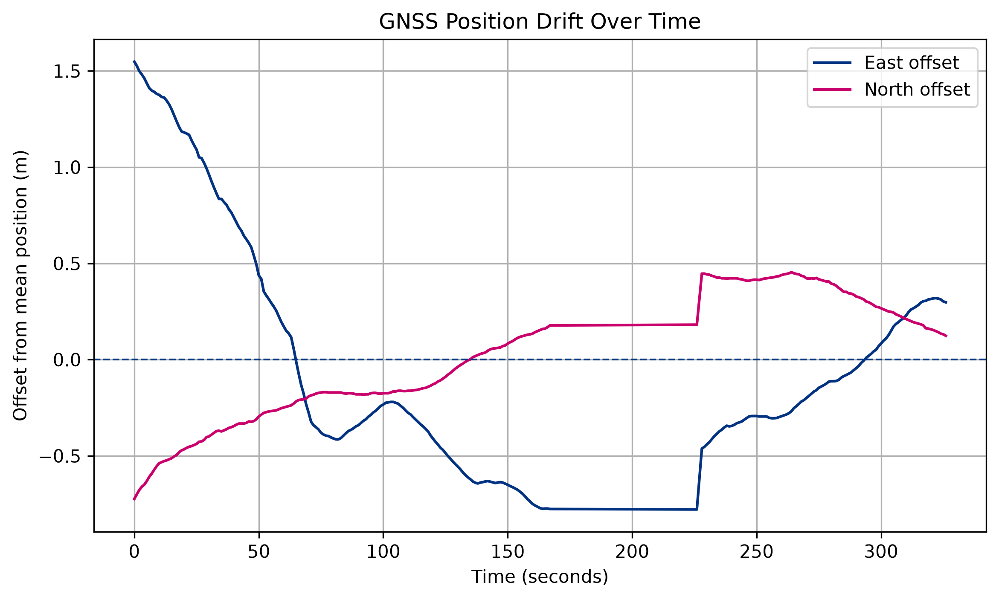
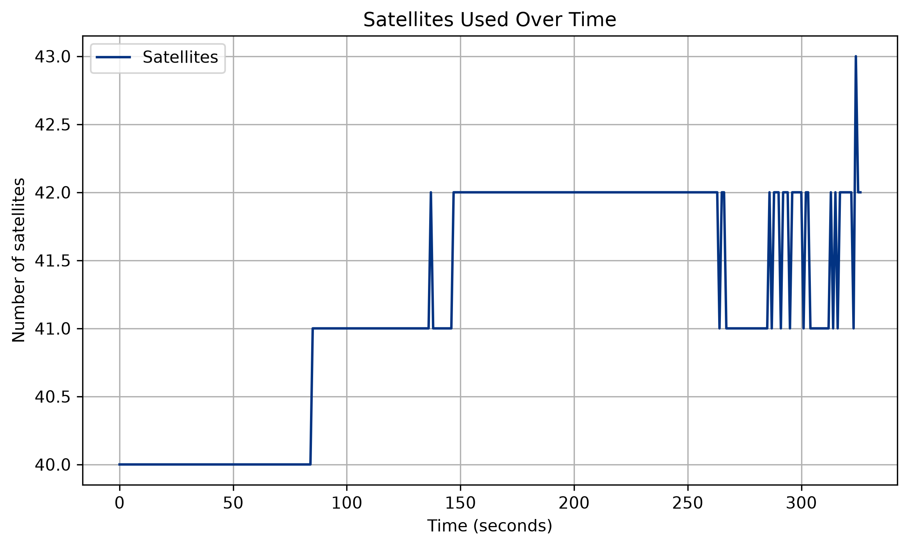
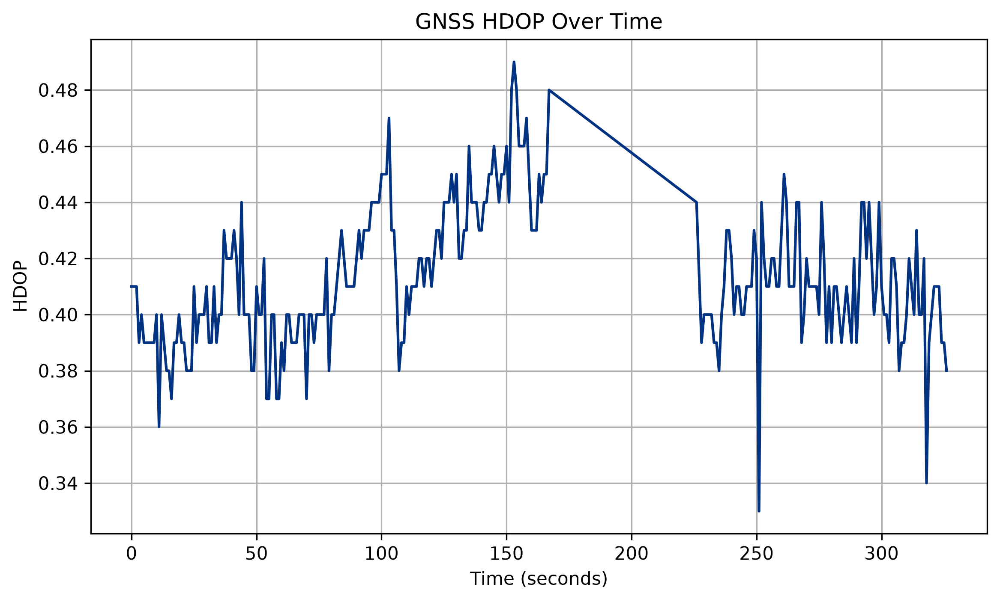
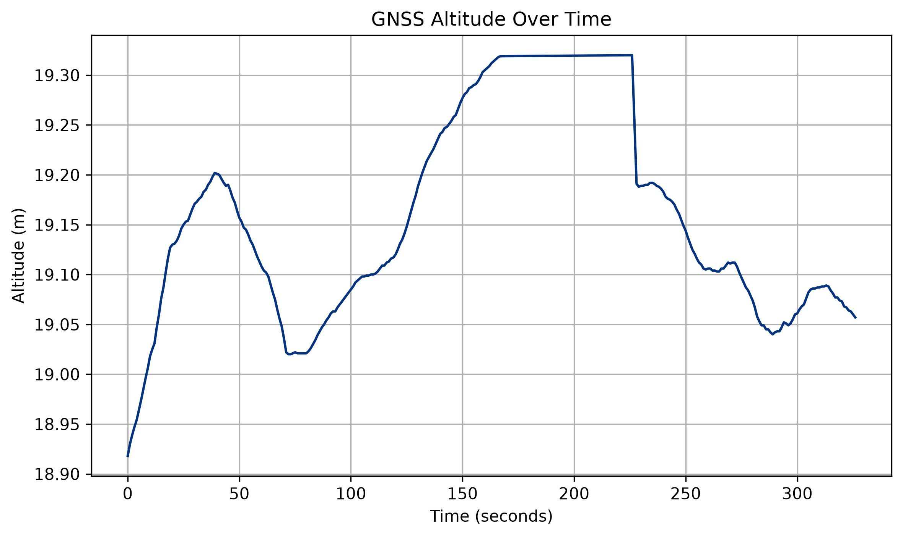
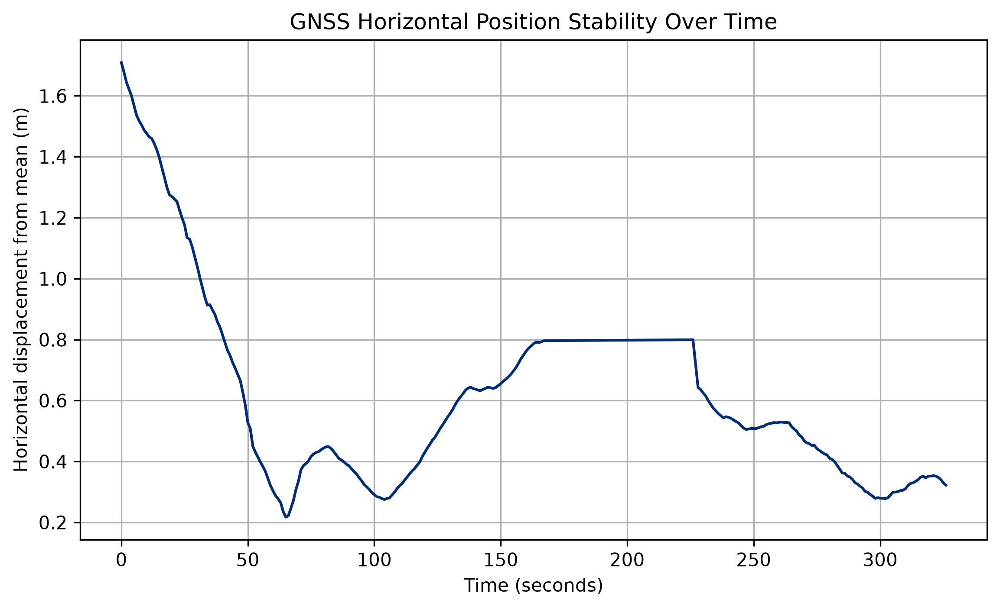

# GNSS Positioning Analysis

A Python-based GNSS project exploring both GNSS positioning algorithms and live measurements from a physical GNSS receiver.

The project began by developing a positioning pipeline using RINEX observation and navigation data. It has since been extended to collect and analyse live GNSS measurements from a dual-frequency GNSS receiver.

## Project Overview

The project currently contains two main parts:

### 1. RINEX Positioning Pipeline

Processes RINEX observation and navigation data to estimate a receiver position from satellite pseudorange measurements.

The pipeline includes:

- Broadcast ephemeris processing
- Satellite ECEF position calculation
- Satellite clock correction
- Signal travel-time correction
- Earth-rotation (Sagnac) correction
- Iterative least-squares positioning
- ECEF to latitude/longitude/altitude conversion
- Pseudorange residual analysis

### 2. Live GNSS Receiver Analysis

A physical GNSS receiver is connected to a computer through USB serial communication.

Python reads live NMEA messages from the receiver, extracts position information and records the measurements for further analysis.

The live analysis currently includes:

- Latitude, longitude and altitude
- Number of satellites used
- HDOP
- GNSS fix quality
- Position scatter
- Position drift over time
- Horizontal position stability
- Altitude variation over time


## RINEX Positioning Pipeline

```text
RINEX Observation + Navigation Data
                ↓
        Pseudorange Extraction
                ↓
       Broadcast Ephemerides
                ↓
     Satellite ECEF Positions
                ↓
      Satellite Clock Correction
                ↓
   Earth-Rotation / Sagnac Correction
                ↓
    Iterative Least-Squares Solution
                ↓
     Receiver ECEF Coordinates
                ↓
 Latitude / Longitude / Altitude
                ↓
      Residual Performance Analysis
```

## RINEX Positioning Results

For the sample GNSS epoch analysed, the positioning solution produced:

- **Pseudorange residual RMSE:** 6.66 m
- **Maximum absolute residual:** 11.47 m
- **Estimated receiver altitude:** 516.27 m
- **Receiver clock bias:** 30.12 m

The residuals show how closely the final receiver solution explains the measured satellite pseudoranges.




## How the Positioning Pipeline Works

### 1. RINEX Data Processing

The pipeline reads RINEX observation and navigation files using GeoRinex.

The observation file provides pseudorange measurements, while the navigation file provides the broadcast ephemeris parameters required to calculate satellite positions.

### 2. Satellite Position Calculation

Broadcast orbital parameters are used to calculate each satellite's position in Earth-Centred Earth-Fixed (ECEF) coordinates.

The approximate signal travel time is:

τ = ρ / c

where `ρ` is the measured pseudorange and `c` is the speed of light.

### 3. GNSS Corrections

Two important corrections are applied:

- **Satellite clock correction** — compensates for satellite clock offsets using broadcast clock parameters.
- **Earth-rotation (Sagnac) correction** — accounts for the rotation of the Earth while the GNSS signal travels to the receiver.

### 4. Receiver Position Solution

Corrected pseudoranges and satellite ECEF coordinates are used in an iterative nonlinear least-squares solution.

For each satellite:

ρᵢ ≈ √[(xᵢ − x)² + (yᵢ − y)² + (zᵢ − z)²] + b

where `(x, y, z)` is the unknown receiver position and `b` is the receiver clock bias.

The resulting ECEF coordinates are converted into latitude, longitude and altitude.

### 5. Residual Analysis

Predicted pseudoranges are compared with the measured pseudoranges after the receiver position has been calculated.

For the analysed epoch, the pseudorange residual RMSE was **6.66 m**.


# Live GNSS Receiver

The project was extended from offline RINEX processing to measurements from a physical GNSS receiver.

The receiver sends NMEA messages through a USB serial connection. Python reads these messages and extracts the GNSS position solution.

The `$GNGGA` message is currently used to obtain:

- Latitude
- Longitude
- Altitude
- Number of satellites
- HDOP
- Fix quality

Measurements are saved to CSV files so the receiver's behaviour can be analysed over time.


## Stationary Receiver Experiment

The GNSS receiver was kept stationary while position fixes were recorded for approximately five minutes.

Even though the receiver was not moving, its calculated position changed slightly over time due to GNSS measurement uncertainty.

For the longer stationary dataset:

- **Number of fixes:** 268
- **Mean horizontal displacement from mean position:** 0.586 m
- **Maximum horizontal displacement:** 1.709 m
- **Position standard deviation:** 0.334 m
- **95th percentile horizontal scatter:** 1.437 m

This experiment demonstrates how a stationary GNSS solution can still drift as satellite geometry and measurement conditions change.


## Position Scatter

The latitude and longitude measurements are converted into local east/north offsets from the mean measured position.




## Position Drift Over Time

The east and north offsets show how the estimated position changes during the stationary experiment.




## Satellite Count

The number of satellites used by the receiver was monitored during the experiment.




## HDOP

HDOP was recorded to investigate the relationship between satellite geometry and position stability.




## Altitude

The receiver's altitude estimate was also monitored over time.




## Horizontal Position Stability

The horizontal displacement from the mean position shows the overall stability of the stationary GNSS solution.




## Project Structure

The project is organised into:

- `data/` — RINEX files and recorded live GNSS datasets
- `figures/` — generated GNSS analysis figures
- `notebooks/` — exploratory analysis
- `src/` — Python source code

Key source files include:

- `read_rinex.py` — RINEX GNSS positioning pipeline
- `satellite_position.py` — satellite ECEF position calculation
- `positioning.py` — iterative least-squares receiver positioning
- `coordinates.py` — ECEF to geodetic coordinate conversion
- `read_navigation.py` — navigation data processing
- `live_gnss.py` — live NMEA receiver logging
- `analyse_live_gnss.py` — stationary receiver stability analysis


## Technologies

- Python
- NumPy
- pandas
- Matplotlib
- GeoRinex
- xarray
- pyserial
- RINEX
- NMEA GNSS data


## Key Skills Demonstrated

- GNSS positioning
- Scientific Python programming
- Real GNSS hardware integration
- Serial communication
- NMEA data processing
- RINEX data processing
- Satellite orbit calculations
- Coordinate transformations
- Nonlinear least-squares estimation
- GNSS measurement corrections
- Position stability analysis
- Data visualisation


## Running the Project

Create and activate a Python virtual environment:

```bash
python3 -m venv .venv
source .venv/bin/activate
```

Install the required dependencies:

```bash
pip install numpy pandas matplotlib georinex xarray pyserial
```

Run the RINEX positioning pipeline:

```bash
python src/read_rinex.py
```

Run live GNSS data collection:

```bash
python src/live_gnss.py
```

Analyse a recorded stationary dataset:

```bash
python src/analyse_live_gnss.py
```


## Future Improvements

Planned extensions include:

- Analysing individual satellites using NMEA GSV messages
- Comparing GPS, Galileo, GLONASS and BeiDou observations
- Analysing satellite elevation, azimuth and signal strength
- Investigating the relationship between satellite signal quality and position drift
- Comparing measurements under different environmental conditions
- Adding ionospheric and tropospheric delay models to the RINEX positioning pipeline
- Investigating dual-frequency GNSS measurements
- Connecting receiver observations more directly to the custom positioning pipeline


## Summary

This project explores GNSS from both a software and hardware perspective.

The RINEX pipeline implements the core mathematics required to calculate satellite positions and estimate a receiver position from pseudorange measurements.

The live receiver extension applies GNSS analysis to real measurements from physical hardware, allowing position stability, satellite availability, HDOP and measurement drift to be investigated experimentally.
